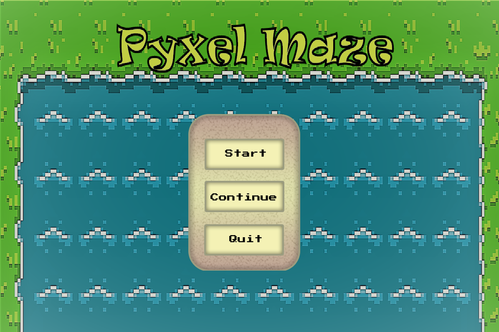
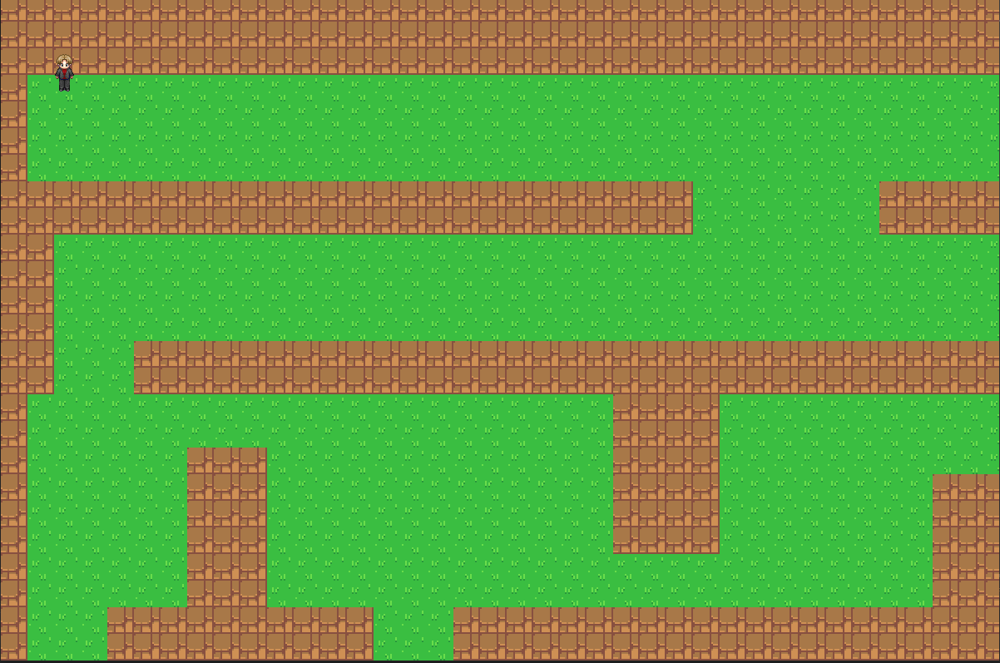

      

PyxelMaze is a 2D Puzzle Adveture game for windows/linux based operation systems.PyxelMaze is a 2D Puzzle Adventure game. The player should find a way out to be free. 
The 0.10 version of this game represents the menu interface and maze where the player is walking and looking for treasure to be free. The player must be careful not to get lost.

Main menu:

Game:

### Tech

To build this game, I work with:
* Git
* Visual Studio
* C++
* STL
* SDL 2.0
* CRT lib
